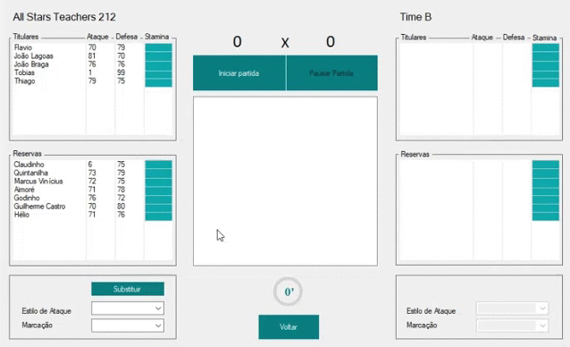

# BRASFOOT CP2

## Indice
- [Sobre](#-sobre)
- [Como funciona](#-como-funciona)
- [Considerações pessoais](#-considerações-pessoais)
- [Tecnologias Utilizadas](#-tecnologias-utilizadas)
- [Como baixar o projeto](#-como-baixar-o-projeto)
## 🔖 Sobre
O projeto BrasFoot CP2 é uma versão alternativa do jogo BrasFoot. Feito por mim e por meus amigos de escola, o projeto era um trabalho para colocar em prática as tecnologias aprendidas no segundo ano do ensino médio integrado com  o curso técnico em desenvolvimento de sistemas no Colégio Pedro II, que todos nós cursávamos.
## 🛠 Como funciona
Como dito anteriormente, a ideia foi baseada no Brasfoot, então a nossa versão também é um jogo de gerenciamento de clubes de futebol. De forma simplificada, a pessoa que está jogando "interpreta" o treinador do time. 
O BrasFoot CP2 é um pouco mais simples que a sua inspiração, você escolhe o time que quer jogar e pode jogar partidas contra times aleatórios. Todos os times dentro do jogo eram times que participaram do campeonato de futsal do campus, exceto o All Star Teachers, que é o time com alguns dos nossos professores da época.
## 🚀 Tecnologias utilizadas
O projeto foi desenvolvido utilizando as seguintes tecnologias:
- C#
- SQL Server
## 📃 Considerações pessoais
Eu gosto bastante do BrasFoot CP2, foi um dos primeiros projetos em programação desenvolvidos por mim, além de que a implementação desse projeto em ambiente escolar e com acompanhamento dos professores foi de grande importância para convergir os conhecimentos do meu segundo ano no técnico em algo palpável. Com esse projeto aprendi bastante sobre C#, Programação Orientada a Objetos, Banco de Dados e SQL. 
## 🎮 Como Jogar
```bash
    # Clonar o repositório
    $ git clone 
    # Iniciar o SQL Server
    # Fazer o deploy
```

